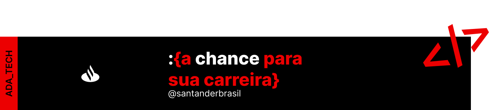

###### Repositório criado para os projetos realizados através do programa sem fins lucrativos do [Santander Coders](https://ada.tech/sou-aluno/programas/santander-coders-2024) na trilha de Front-end!
### Conteúdo didático disponibilizado:
- [x] Front-end Estático (HTML e CSS)
- [x] Lógica de Programação (JS)
- [x] Programação Orientada a Objetos (JS)
- [x] Front-end Dinâmico (JS DOM)
- [x] Angular I
- [x] Angular II

`HTML` `CSS` `JavaScript`
#### Ada Tech — Santander Open Academy <3
